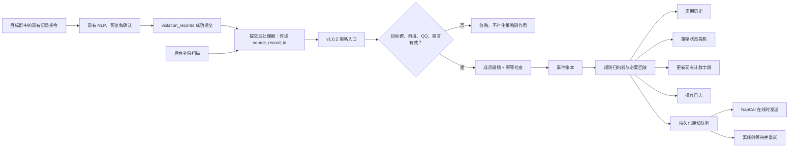
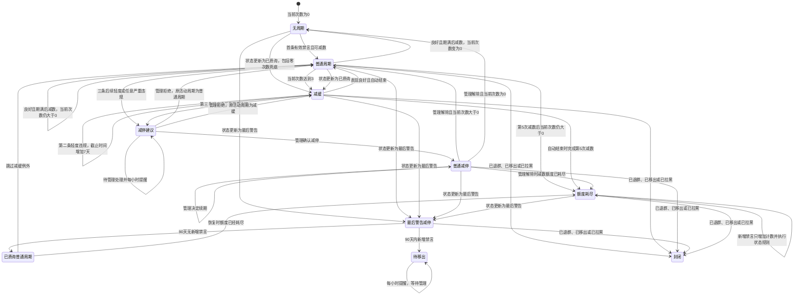
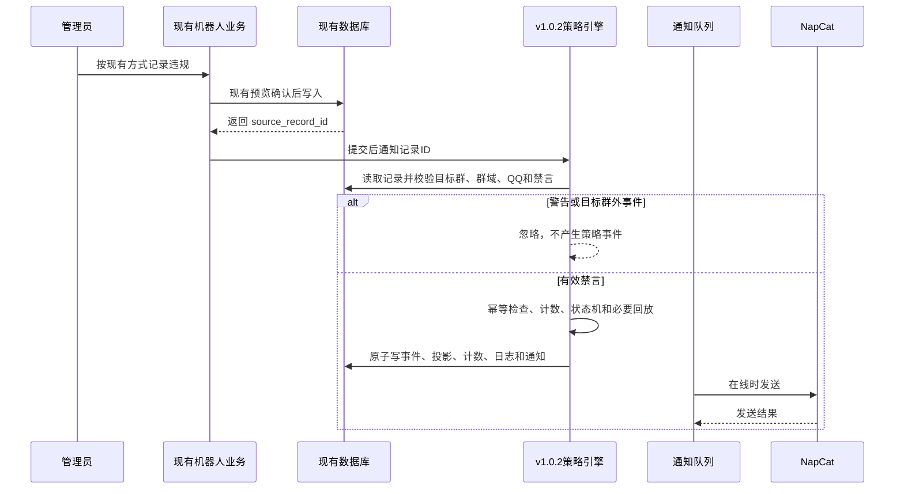
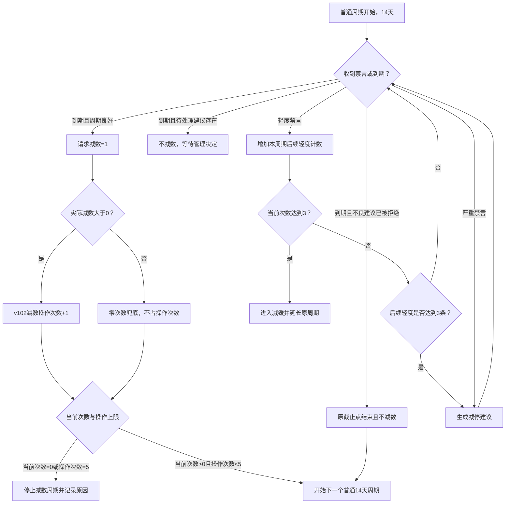
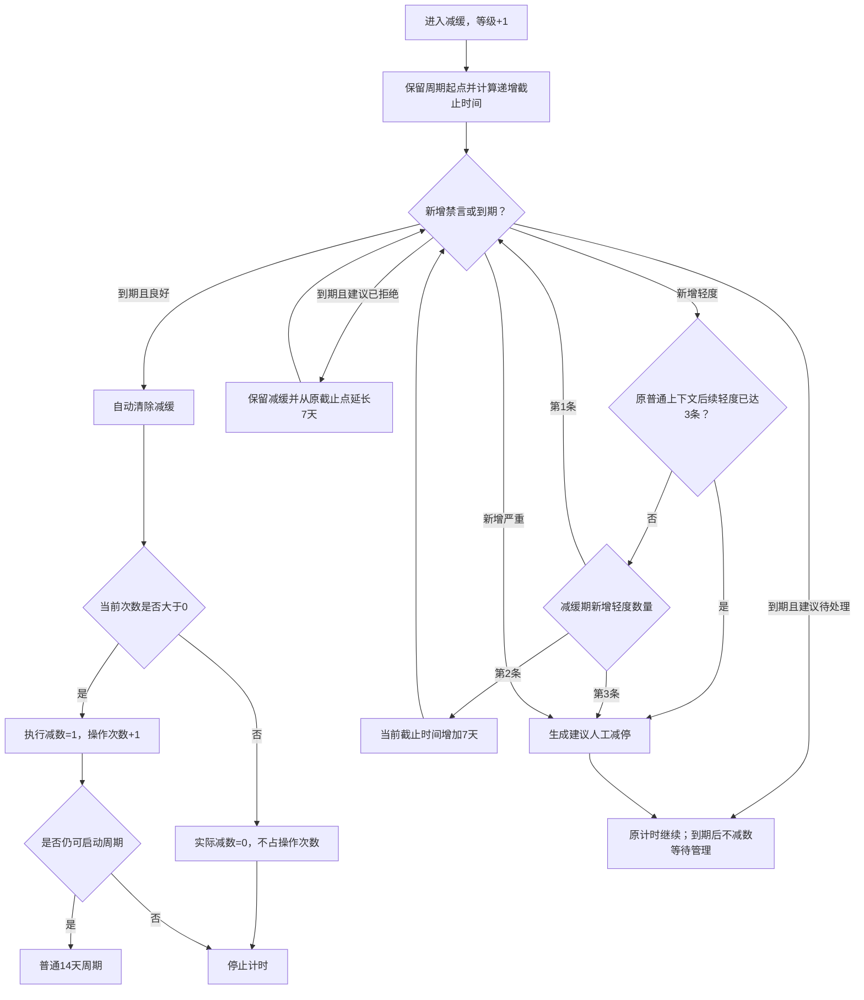
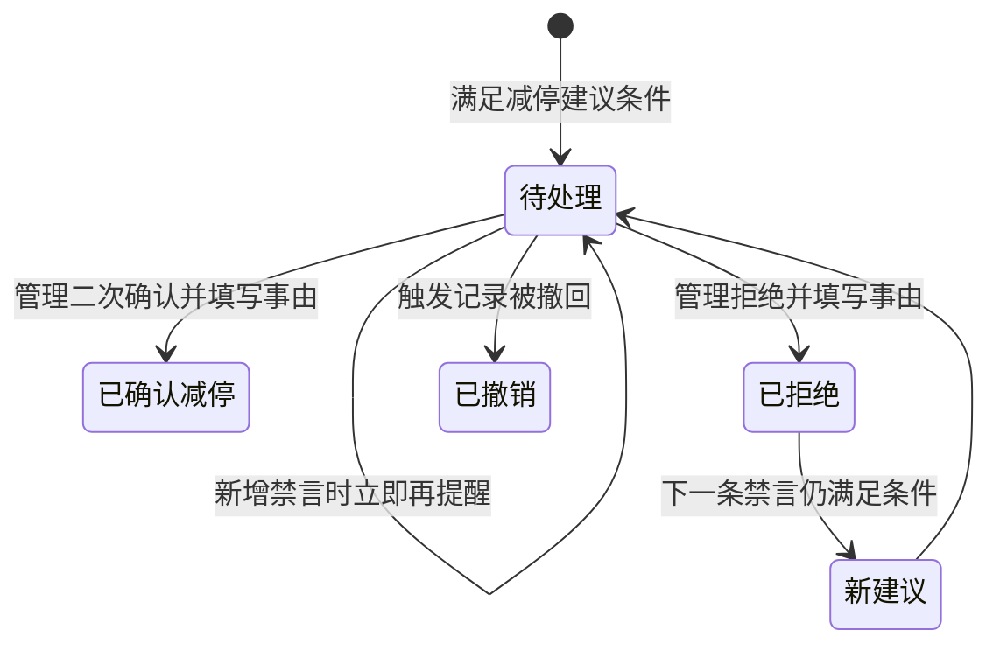
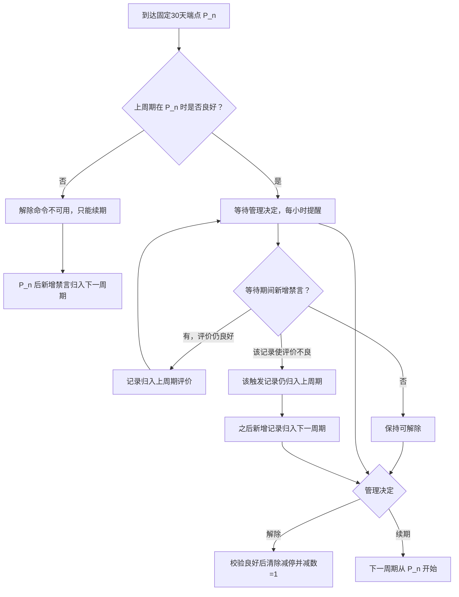
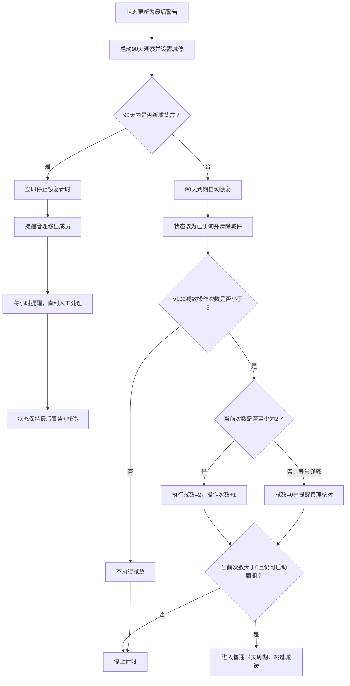
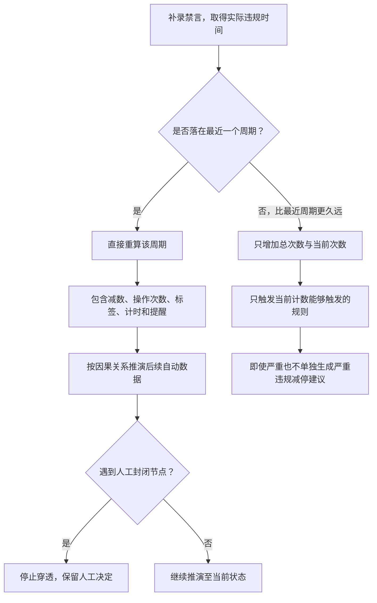
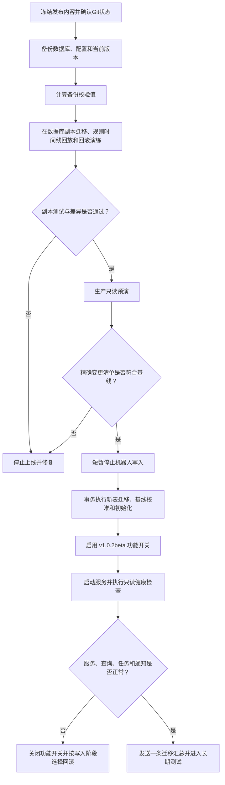

# QQ 违规记录机器人 v1.0.2beta PRD：减数策略引擎

## 1. 文档信息

| 项目 | 内容 |
|---|---|
| 产品 | QQ 违规记录机器人 |
| 需求版本 | v1.0.2beta |
| PRD 日期 | 2026-08-01 |
| 需求基线 | 2026-07-13 减数机制提案 |
| 文档用途 | 产品确认、技术评审、实施计划和验收基线 |
| 文档状态 | 产品设计已确认，待技术评审与实施 |
| 目标环境 | 生产机器人，运行时目标群由 `TARGET_GROUP_ID` 指定 |
| 发布语言 | 中文 |

## 2. 背景与问题

现有系统采用每周自动减计。该机制实现简单，但对周期性违规成员的约束不足，也无法表达“减缓”“减停”“最后警告观察期”等管理策略。管理组需要在不改变现有记录、查询和 NLP 交互的前提下，引入可追溯、可回放、可人工干预的新减数机制。

本版本的困难不在单个定时任务，而在以下规则同时成立：

1. 普通周期、递增减缓周期、普通减停周期和最后警告观察期并存；
2. 自动事件和人工决定具有不同的回放边界；
3. 撤回记录需要完整回退，补录记录只能有限追溯；
4. 一个 QQ 可以出现在不同群域，各群域状态必须独立；
5. 减数值与减数操作次数是两个不同概念；
6. NapCat 离线、服务重启和重复调度不能导致漏算或重复减数；
7. 上线时需要按管理组提供的准确数据校准现有数据库，但不能伪造历史违规记录。

## 3. 产品目标

本版本需要实现：

1. 将普通自动减数周期调整为 14 天；
2. 增加递增的“减缓”标签和固定 30 天的“减停”标签；
3. 支持最后警告 90 天观察与自动恢复；
4. 将 `v1.0.2beta` 上线后的成功减数操作次数限制为每个成员群域最多 5 次；
5. 自动识别禁言时长，区分轻度和严重违规；
6. 让管理组能够减停、解除、续期和拒绝建议，并要求事由；
7. 记录所有自动和人工事件，支持查询和周报；
8. 对撤回和补录执行确定、可审计的事件重演；
9. 将规则引擎与 NapCat 连接状态解耦，离线时照常结算并补发通知；
10. 按批准的数据基线校准现有当前次数，并提供完整回滚点。

## 4. 核心红线

### 4.1 不得改变的业务

- 不修改现有 NLP 意图分类、实体抽取、模糊搜索和提示词；
- 不改变新增违规记录的用户输入格式、预览、确认、取消和入库结果；
- 不改变现有成员查询、记录查询、排序、证据图片展示和历史数据兼容逻辑；
- 不改变现有斩杀线；
- 不赋予机器人自动移出成员的权限；
- 不把警告计算为一次违规；
- 不处理运行时目标群之外的任何消息、命令或策略事件；
- 不同步管理基线表中的昵称；
- 不删除或覆盖数据库中未被基线表覆盖的旧成员状态；
- 不在公开 Git 仓库中保存生产群号、QQ、数据库、聊天日志、证据图片或原始基线表。

### 4.2 本版本不做

- 不优化昵称模糊搜索；该事项保留给 `v1.0.4-beta`；
- 不新增周报 AI 评估，只提供结构化日志；
- 不引入“已封存”标签；
- 不改变 root 运行权限、数据库文件权限或模型权限；
- 不自动踢人，不自动代替管理决定解除或续期减停。

## 5. 术语与数学模型

### 5.1 成员状态主键

成员策略状态按以下复合键隔离：

```text
member_key = (group_area, member_qq)
```

`group_area` 为蜂巢、蜂窝或蜂箱。同一 QQ 出现在不同群域时，计数、标签、周期、减数值和减数操作次数均相互独立。

### 5.2 违规事件

对成员群域 `m` 的第 `i` 个记录事件定义为：

```text
e_i = (source_record_id, violation_time, action_type, mute_seconds, ingest_time)
```

是否计数：

```text
countable(e_i) = 1, action_type = mute 且记录未撤回
                 0, 其他情况
```

严重程度：

```text
severity(e_i) = severe, mute_seconds >= 3600
                light,  0 < mute_seconds < 3600
                none,   action_type != mute
```

“禁言 1 小时”与“禁言 60 分钟”均落在严重违规边界。警告记录的 `countable=0`，不会改变总次数、当前次数或周期表现。

一条现有业务记录的处理类型为警告或禁言，二者互斥，不存在同一条记录同时按警告和禁言处理的情况。

### 5.3 次数模型

基线迁移为每个数据库保存：

```text
cutover_at                  = 正式启用时间
cutover_record_watermark    = 启用事务开始前最大的 source_record_id
baseline_covered_record_set = 已由基线次数覆盖的历史记录集合
```

补偿扫描不得把 `baseline_covered_record_set` 中的历史记录重新转成计数事件。正式启用后新增的记录即使实际违规时间早于 `cutover_at`，仍属于新的补录输入，再按补录规则决定是否回算。

定义现有违规表中尚未撤回的可计数禁言原始数量：

```text
R_m(q) = sum(countable(source_record_i)) at processing_time q
```

基线迁移计算一次固定校准差值：

```text
target_total_at_cutover_m = baseline_deduct_m + approved_current_m
baseline_adjustment_m     = target_total_at_cutover_m - R_m(cutover_at)
```

对成员群域 `m`，在系统处理时间 `q`：

```text
T_m(q) = max(0, R_m(q) + baseline_adjustment_m)

D_m(q) = baseline_deduct_m + sum(applied_amount(r_j))
                           for executed_time(r_j) <= q
                           and effective(r_j)

C_m(q) = max(0, T_m(q) - D_m(q))
```

其中：

- `T_m`：数据库中的总次数 `total_count`；
- `R_m`：现有违规记录表按“未撤回禁言”得到的原始计数；
- `baseline_adjustment_m`：批准基线与原始记录之间的固定差值，可正可负；
- `D_m`：历史实际减数总额 `deduct_count`；
- `C_m`：当前次数；
- `r_j`：一次减数结算事件；
- `effective(r_j)`：该结算当前有效，未被撤回回放产生的冲正事件撤销，也未被新一代回放结果取代；
- `applied_amount(r_j)`：该次实际应用的减数值，只能为 `1`、`2` 或零次数兜底下的 `0`。

实际违规时间用于周期归属和状态回放，录入时间与 `cutover_record_watermark` 用于判断该记录是否已经包含在迁移基线中。两种时间不能混用。`total_count` 每次写入绝对投影值 `T_m(q)`，不得在现有记录模块已经更新次数后再次盲目执行 `+1`。

单次请求减数不得形成“预存减数”：

```text
applied_amount = 1, requested_amount = 1 and C_before >= 1 and O_v102_before < 5
                 2, requested_amount = 2 and C_before >= 2 and O_v102_before < 5
                 0, otherwise
```

正常和减缓结算请求 `requested_amount=1`；最后警告恢复请求 `requested_amount=2`。业务正常路径下最后警告恢复时当前次数不会为 `1`。如果迁移异常或回放使其变为 `0` 或 `1`，仍执行状态恢复和清除减停，但实际减数为 `0`、不占操作次数，并记录异常待管理核对；不得把 `减数=2` 降格成 `减数=1`，也不得预存未来减数。

### 5.4 减数操作次数上限

减数操作次数与减数总额独立：

```text
O_v102_m(q) = sum(1 if applied_amount(r_j) > 0 and effective(r_j) else 0)
O_v102_m(q) <= 5
```

`O_v102` 只统计 `v1.0.2beta` 正式启用后的有效成功操作。历史 `deduct_count` 继续进入次数公式，但旧版本无法可靠还原的历史操作次数不追溯；所有成员在本版本的 `O_v102` 初始值均为 `0`。

规则如下：

- `减数=1` 计 1 次操作；
- `减数=2` 也只计 1 次操作；
- 当前次数为 `0` 时执行的兜底结算，实际减数为 `0`，不计操作次数；
- 第 5 次成功减数可以正常执行；
- 第 5 次后不再启动或执行任何减数周期；
- 计数、状态、减停解除、最后警告恢复和斩杀线仍继续工作。

撤回回放不删除原结算事件，而是追加冲正或替代事件，并通过 `reversed_by_event_id`、`superseded_by_replay_id` 标记旧结算失效。回放后重新成立的结算使用新的回放代次幂等键，因此既保留审计链，也允许 `D_m` 和 `O_v102_m` 正确回退或重新增加。

### 5.5 周期长度

普通周期：

```text
L_normal = 14 days
```

第 `k` 次进入减缓时，`k >= 1`：

```text
L_slow(k) = 14 days + 7 days * k
```

因此：

```text
k=1 -> 21 days
k=2 -> 28 days
k=3 -> 35 days
...
```

减缓等级不设上限。每次新的减缓阶段使 `k` 增加 1；普通退出、减停或状态变化不清零。只有撤回记录回放能够撤销由被撤回记录造成的等级增加。

普通减停周期：

```text
L_stop = 30 days
```

最后警告观察期：

```text
L_final_warning = 90 days
```

### 5.6 固定端点

普通减停从 `S_0` 开始，第 `n` 个周期的固定端点为：

```text
P_n = S_0 + 30 days * n
```

人工决定时间不改变 `P_n`。若管理在 `P_n` 后决定续期，下一周期仍从 `P_n` 开始，而不是从人工决定时间开始。

### 5.7 事件排序

状态重演使用稳定排序键：

```text
(effective_time, event_priority, source_sequence)
```

同一实际时间的全序优先级如下：

| `event_priority` | 事件类型 | 规则 |
|---:|---|---|
| 0 | 基线与迁移检查点 | 只在正式启用事务生成 |
| 10 | 禁言生效与补录禁言 | 保证到期同刻先计违规 |
| 20 | 撤回与回放冲正 | 同一来源记录“生效并撤回”时以撤回后的无记录结果为准 |
| 30 | 人工状态更新与人工策略决定 | 包括减停、拒绝、续期、解除和终止状态 |
| 40 | 由输入派生的自动标签、状态和待办 | 不作为新的独立业务输入 |
| 50 | 周期到期与自动结算 | 必须晚于同刻违规和人工决定 |
| 60 | 操作日志与通知出队 | 不参与业务状态计算 |

同一来源记录的撤回具有最终支配性：归约前先将该来源标记为无效，再重演其他事件。同类型同时间使用稳定事件序号保证结果可重复。

所有周期比较使用准确时间点。数据库保存带时区的标准时间，群内显示北京时间。

## 6. 总体架构

采用独立事件账本与当前状态投影。现有记录和查询仍是受保护的业务基线。



### 6.1 现有模块边界

现有记录模块只增加两个确定性联动点：

1. 违规记录提交成功后传递 `source_record_id`；
2. 撤回提交成功后传递同一 `source_record_id`。

策略失败不能回滚已成功写入的违规记录。后台补偿扫描会发现“已入库但尚未处理”的记录并重试。该方式不修改用户输入、NLP 或查询 SQL。

### 6.2 新增逻辑数据表

表名在实施阶段遵循现有命名规范，但必须使用独立 `v102` 命名空间，不复用历史实验表。

#### 事件账本

| 字段 | 说明 |
|---|---|
| `event_id` | 全局唯一业务事件编号 |
| `member_qq`、`group_area` | 成员群域主键 |
| `event_type` | 禁言、撤回、补录、结算、减数、标签、状态、人工决定、提醒、迁移等 |
| `effective_time` | 业务实际生效时间 |
| `ingest_time` | 系统收到或生成事件的时间 |
| `source_record_id` | 关联现有违规记录；非记录事件可为空 |
| `caused_by_event_id` | 因果事件，用于撤回派生变化 |
| `reversed_by_event_id` | 撤回回放产生的冲正事件；为空表示未被直接冲正 |
| `superseded_by_replay_id` | 被哪一代回放结果取代 |
| `replay_generation` | 同一成员群域的回放代次 |
| `payload_json` | 结构化参数，不保存聊天原文 |
| `rule_version` | 固定为本版本规则标识 |
| `idempotency_key` | 防止重复处理 |

#### 周期历史

| 字段 | 说明 |
|---|---|
| `cycle_id` | 周期唯一编号 |
| `cycle_type` | `normal`、`slow`、`stop`、`final_warning` |
| `start_at`、`due_at` | 固定开始和截止时间 |
| `slow_level` | 减缓周期等级，非减缓可为空 |
| `status` | 活动、待人工决定、自动结束、人工结束、被回放替换 |
| `light_count`、`severe_count` | 本周期归属的违规统计 |
| `evaluation_owner_cycle_id` | 等待决定期间记录实际归属的评价周期 |
| `assignment_rule_version` | 固定记录归属算法版本 |
| `decision_event_id` | 人工封闭节点 |
| `settlement_event_id` | 自动结算事件 |

#### 策略状态投影

| 字段 | 说明 |
|---|---|
| `member_qq`、`group_area` | 复合主键 |
| `tag` | `none`、`slow`、`stop`，后两者互斥 |
| `slow_level` | 永久累计减缓等级 |
| `v102_operation_count` | 本版本启用后已成功执行的减数操作次数，最大 5 |
| `active_cycle_id` | 当前周期 |
| `no_cycle_reason` | 无活动周期原因：`zero_count`、`operation_limit`、`terminal_status` 或空 |
| `pending_action_type` | 待处理减停建议、到期决定、移出提醒等 |
| `last_processed_event_id` | 投影水位 |
| `state_version` | 乐观锁版本 |

#### 通知队列

| 字段 | 说明 |
|---|---|
| `notification_id` | 通知唯一编号 |
| `event_id` | 来源业务事件 |
| `message_type` | 即时通知、周期提醒、纠正通知、迁移汇总 |
| `scheduled_at` | 应发送时间 |
| `status` | 待发送、发送中、已发送、失败 |
| `attempt_count` | 重试次数 |
| `sent_at` | 实际发送时间 |
| `last_error_class` | 脱敏错误类型 |

#### 迁移检查点

| 字段 | 说明 |
|---|---|
| `migration_id` | 本次上线迁移批次 |
| `cutover_at` | 正式启用时间 |
| `cutover_record_watermark` | 基线已经覆盖的最大历史记录编号 |
| `source_digest` | 私有基线来源哈希，只保存在生产审计数据中 |
| `before_backup_digest` | 上线前数据库备份校验值 |
| `status` | 预演、已提交、已回滚 |

### 6.3 事务边界

一次策略处理在同一数据库事务中完成：

```text
写入策略事件
-> 重算或增量归约
-> 更新周期历史
-> 更新策略状态投影
-> 更新现有 total_count / deduct_count / current_count_cache
-> 写操作日志
-> 写通知队列
-> 提交
```

通知发送位于事务外。发送失败不会回滚业务状态，恢复连接后继续重试。

## 7. 总体状态机

标签与成员状态正交：成员可处于正常、已质询、最后警告、已退群、已移出或已拉黑，同时具有 `none`、`slow` 或 `stop` 标签。`slow` 与 `stop` 不允许同时存在。



减停建议是叠加在原活动周期上的待办，不是替换普通周期或减缓周期的新计时状态。等待管理期间，原活动周期继续运行。

当 `v102_operation_count=5` 时，所有指向普通周期或减缓周期的减数计时转换被关闭，`no_cycle_reason=operation_limit`。状态、标签变化、违规计数和移出提醒仍可执行。该状态与“当前次数为 0”以及“成员已离群”的无周期原因必须在查询中明确区分。

## 8. 违规记录自动联动



正常路径即时处理。补偿任务只扫描 `cutover_record_watermark` 之后以及明确登记为“正式启用后新增”的未处理记录；同一个 `source_record_id` 只能产生一次“记录生效”策略事件。迁移前历史记录已由基线覆盖，不进入首次补偿队列。

### 8.1 禁言时长解析

策略引擎复用现有记录入库后的规范化处理文本或结构化字段，通过确定性代码识别 `禁言10分钟`、`禁言 10 分钟`、`禁言一小时`、`禁言1小时` 等等价表达，并统一换算为 `mute_seconds`。该步骤不调用 NLP，也不改变现有记录校验。

如果一条新记录已明确属于禁言但无法确定时长：

- 仍按一条禁言增加总次数；
- 不猜测轻度或严重；
- 将策略事件标记为“时长待核对”，暂停该成员依赖严重程度的自动结算；
- 写入脱敏错误日志并提醒管理撤回后按明确时长重新记录；
- 纠正后通过撤回与重新记录流程恢复确定状态。

解析异常不能回滚已经成功写入的现有违规记录，也不能让未知时长被静默当成轻度违规。

## 9. 普通周期

### 9.1 启动

- 当前次数从 `0` 变为 `1` 时启动普通 14 天周期；
- 触发周期的首条禁言是基准记录，不计入“周期内后续新增”数量；
- 若首条记录本身为严重违规，仍立即生成减停建议；
- 当前次数已大于 `0` 但没有活动周期的合法迁移状态，从正式启用时间启动周期；
- 已达到 5 次减数操作上限时不启动周期。

### 9.2 过程与结算



普通周期期满时，若没有严重违规且周期内后续轻度禁言不超过 1 条，执行 `减数=1`。如果已经转入减缓，则由减缓规则决定结算。

### 9.3 当前次数达到 3

当前次数达到 `3` 时立即进入减缓，不等待普通周期截止。普通周期起点保持不变，截止时间按减缓等级延长。

系统同时保留两个判定上下文：

1. 原普通周期“后续轻度记录数”，用于判定第 3 条后续轻度触发减停建议；
2. 进入减缓后的“减缓期新增记录数”，触发减缓延期和减停建议。

同一记录可以影响不同规则的阈值判断，但只能归属一个周期，且不会被重复增加总次数。

### 9.4 不良周期到期

普通周期或减缓周期已经生成减停建议时，不允许在表现不良的情况下照常减数：

1. 到期时建议仍待管理处理：不执行减数，周期结算进入等待状态并每小时提醒；
2. 管理确认减停：以确认时间启动普通减停 30 天；
3. 管理拒绝且原周期为普通周期：原周期在原截止时间结束且不减数，从该截止时间启动新的普通 14 天周期；
4. 管理拒绝且原周期为减缓：保留减缓标签与等级，从原截止时间再延长 7 天；
5. 管理在到期前已拒绝：到期时直接执行第 3 或第 4 条；
6. 管理在到期后才拒绝：仍以原截止时间计算新的起点或延期；如果新的截止时间也已过去，立即补算但仍不得替管理作决定。

这一定义只决定不良周期如何关闭，不会清除违规计数。拒绝后下一条禁言再次满足条件时仍会创建新的减停建议。

## 10. 减缓

### 10.1 进入条件

满足任一条件进入减缓：

- 当前次数达到 `3`；
- 管理把状态更新为“已质询”。

最后警告 90 天自动恢复为“已质询”是唯一例外，该路径直接进入普通周期，不进入减缓。

### 10.2 计时

进入新的减缓阶段时：

```text
slow_level := slow_level + 1
due_at := cycle_start + L_slow(slow_level)
```

从普通周期转入减缓时，`cycle_start` 不变，因此是延长而不是重置。减缓期出现第 2 条新增轻度禁言时：

```text
due_at := due_at + 7 days
```

本次延期只执行一次，已有违规计数不清零。

### 10.3 过程与退出



图中的“等待管理”表示原减缓计时继续；只有到达截止时间后才暂停结算且不执行减数。

触发减缓的记录不作为减缓期新增记录再次计算。减缓不能被管理直接清除；只能自动完成、被减停替换，或因撤回记录而回放消失。

### 10.4 已质询且当前次数为 0

该情况虽然罕见，但使用统一兜底：

- 立即进入减缓并启动对应周期；
- 周期结束时仍为 `0`，完成结算但实际减数为 `0`；
- 不增加 `deduct_count`，不占用减数操作次数；
- 周期内新增禁言先正常增加计数；
- 管理随后更新为最后警告时，立即转入 90 天减停。

## 11. 减停建议

### 11.1 触发

以下情况生成建议人工减停：

- 初始普通周期内出现第 3 条后续轻度禁言；
- 普通周期或减缓期内出现严重违规；
- 减缓期内出现第 3 条新增轻度禁言。

建议只是一项待管理动作，不会立刻冻结或重置当前周期。

### 11.2 生命周期



待处理建议没有自动过期时间。管理确认、明确拒绝或触发记录撤回后才关闭。拒绝后下一条禁言仍满足条件时创建新的建议，而不是恢复旧建议。

## 12. 普通减停

### 12.1 启动

管理执行减停必须提供群域、QQ 和非空事由，并通过现有二次确认。确认时间为首个 30 天周期起点：

```text
S_0 = manual_confirm_time
P_1 = S_0 + 30 days
```

进入减停时：

- `tag` 从 `slow` 或 `none` 变为 `stop`；
- 原减数计时被重置；
- 已累计减缓等级保留；
- 人工确认事件成为不可被补录穿透的封闭节点。

### 12.2 表现评价

普通减停的良好条件：

```text
good = (light_count <= 1) and (severe_count = 0)
```

到达固定端点后，系统进入“待管理决定”，每小时提醒。系统不能自动解除或续期。

### 12.3 等待期间记录归属



记录归属一旦确定，不会跨两个周期重复计算。

为消除管理延迟跨越多个固定端点时的歧义，定义记录实际时间对应的固定周期序号：

```text
chronological_cycle(t) = 1 + floor((t - S_0) / 30 days)
```

等待决定期间使用独立的 `evaluation_owner_cycle_id`：

```text
if cycle_n is pending and final_evaluation(cycle_n) is still good:
    owner(new_record) = cycle_n
    # 使 cycle_n 首次变为不良的触发记录仍留在 cycle_n
else:
    owner(new_record) = max(n + 1, chronological_cycle(actual_violation_time))
```

因此，固定时间区间与评价归属只在“上一周期到期时仍良好且等待人工决定”这一例外中允许不同。系统必须把实际时间区间和 `evaluation_owner_cycle_id` 同时写入周期历史，技术实现不得仅凭时间范围再次归属。

如果管理延迟超过一个或多个 30 天端点，系统按周期序号从小到大补算。空周期也必须等待人工决定，不得自动解除或续期；已经归入上一评价周期的记录不会再次进入补算周期。

### 12.4 人工决定

解除减停：

- 必须在最终评价仍良好时执行；
- 不良时系统拒绝命令；
- 清除 `stop` 标签；
- 操作次数少于 5 且当前次数大于 `0` 时执行 `减数=1`；
- 减数后当前次数大于 `0` 时进入普通 14 天周期；
- 当前次数为 `0` 或操作次数达到 5 时不再启动周期。

续期减停：

- 必须由管理明确决定并提供事由；
- 下一周期从上一个固定端点 `P_n` 开始；
- 决定时间不移动周期端点；
- 管理长时间未决定时，系统只每小时提醒；
- 若决定时后续周期也已到期，完成上一人工决定后立即补算并再次等待人工决定。

## 13. 最后警告

### 13.1 进入

管理把状态更新为“最后警告”时：

- 立即设置 `tag=stop`；
- 替换减缓并重置原减数计时；
- 保留减缓等级；
- 从状态更新时间启动 90 天观察期。

### 13.2 观察期结果



最后警告期间不会再叠加警告。任何新增禁言均触发移出提醒，不要求机器人拥有移出权限。

90 天自动恢复后，管理仍根据现有当前次数和既有斩杀线决定是否移出。系统状态保持“已质询”，不会自动改成正常。

### 13.3 补录纠正

若成员已经自动恢复为已质询，后来补录一条实际发生在该 90 天内的禁言：

- 保留当初人工设置最后警告的决定；
- 撤销错误的自动恢复、`减数=2` 及其派生自动数据；
- 恢复“最后警告 + 减停”；
- 立即生成移出提醒；
- 不穿透补录之后已经存在的人工封闭节点。

## 14. 状态与标签交互

| 状态变化 | 标签与周期结果 |
|---|---|
| 更新为已质询 | 自动进入减缓；当前次数为 0 时使用零次数兜底 |
| 最后警告自动恢复为已质询 | 清除减停，执行 `减数=2`，直接进入普通周期，不进入减缓 |
| 更新为最后警告 | 直接进入减停并启动 90 天观察 |
| 更新为已退群 | 停止所有计时和自动操作，保留计数、标签和历史 |
| 更新为已移出 | 停止所有计时和自动操作，保留计数、标签和历史 |
| 更新为已拉黑 | 停止所有计时和自动操作，保留计数、标签和历史 |

管理不存在把“已质询”改为“正常”的业务路径，本版本不设计该转换。

### 14.1 人工封闭节点与撤回因果

补录不得穿透人工封闭节点；撤回则根据因果关系决定是否回退。所有人工写操作都保留原始审计事件，即使其当前效果在回放后失效。

| 人工事件 | 补录可否穿透 | 撤回触发记录后的处理 |
|---|---|---|
| 确认普通减停 | 否 | 若 `caused_by_event_id` 指向被撤回记录，则撤销其当前效果并重演；独立人工减停保留 |
| 拒绝减停建议 | 否 | 触发建议消失时，拒绝事件保留审计但不再影响投影 |
| 续期普通减停 | 否 | 因果链被撤回时重演；无关续期保留 |
| 清除普通减停 | 否 | 因果链被撤回时连同该次减数重演；无关清除保留 |
| 更新为已质询 | 否 | 由误记录直接引发时恢复原状态和原计时；独立更新保留 |
| 更新为最后警告 | 否 | 由误记录直接引发时恢复原状态和原计时；独立更新保留 |
| 更新为已退群、已移出或已拉黑 | 否 | 仅在明确关联被撤回记录时重演；独立终止决定始终保留 |

`caused_by_event_id` 只能由同一次现有确认流程或明确选择的触发记录建立，不能仅凭时间接近猜测人工操作因果关系。

### 14.2 无周期原因

查询和状态投影必须区分：

- `zero_count`：当前次数为 `0`；
- `operation_limit`：`v102_operation_count=5`，即使当前次数大于 `0` 也不再计时；
- `terminal_status`：已退群、已移出或已拉黑；
- 空值：存在活动周期。

处于 `operation_limit` 时，状态更新、标签记录和移出提醒继续生效，但不得重新开启减数周期。

## 15. 撤回记录

撤回使用完整回放，目标是得到“该记录从未存在”时应有的状态。


规则：

- 撤回会恢复由该记录造成的计数、标签、减缓等级、状态、减数和周期变化；
- 由误记录直接引发的状态更新必须通过 `caused_by_event_id` 关联并一并恢复；
- 与该记录无关的独立人工操作继续保留；
- 不盲目恢复旧快照，而是重演之后的有效事件；
- 误记录存在期间经过的现实时间继续计入原周期。

示例：原周期还剩 9 天，2 天后撤回误记录，恢复后只剩 7 天，而不是重新获得 9 天。

## 16. 补录记录

补录按实际违规时间定位，但采用有限回放，避免久远数据扰动已经执行的管理决策。



最近一个周期可以是普通周期、减缓期或最后警告观察期。补录直接改变其实际发生周期的数据，后续变化必须来自重算结果，不得通过硬编码直接禁止某次后续减数。

比最近周期更久远的补录：

- 不回算历史减数、标签、周期或人工决定；
- 正常增加 `total_count` 和当前次数；
- 当前次数达到 `3` 时仍可进入减缓；
- 达到现有斩杀线时仍执行原有提醒；
- 严重时长本身不再额外生成减停建议。

## 17. 固定管理命令

所有新命令绕过 AI/NLP，只使用确定性解析，并仅在运行时目标群内生效。

### 17.1 写命令

```text
减停 <群域> <QQ> <事由>
清除减停 <群域> <QQ> <事由>
续期减停 <群域> <QQ> <事由>
拒绝减停建议 <群域> <QQ> <事由>
```

规则：

- 群域、QQ 和事由全部必填；
- 不接受昵称代替 QQ；
- 沿用现有管理权限；
- 沿用现有二次确认方式；
- 待确认操作按操作者隔离，避免不同管理员相互确认；
- 确认预览必须显示目标、当前状态、拟执行变化和事由；
- `清除减停` 在不满足良好条件时必须拒绝；
- 所有成功、拒绝和取消结果写操作日志。

写命令前置条件：

| 命令 | 允许状态 | 允许周期/待办 | 明确禁止 |
|---|---|---|---|
| `减停` | 正常或已质询 | 普通/减缓周期，可有减停建议 | 最后警告、普通减停中、已退群、已移出、已拉黑 |
| `清除减停` | 正常或已质询 | 仅普通减停且处于待管理决定，最终评价良好 | 最后警告 90 天观察、移出待办、评价不良 |
| `续期减停` | 正常或已质询 | 仅普通减停且处于待管理决定 | 最后警告 90 天观察、尚未到期的普通减停 |
| `拒绝减停建议` | 正常或已质询 | 仅存在活动减停建议，底层为普通或减缓周期 | 最后警告、普通减停、无待处理建议 |

最后警告的进入、恢复和终止只能通过既有状态更新及其专属自动规则处理。四个通用减停命令不得根据 `tag=stop` 直接操作最后警告 90 天观察期。

### 17.2 查询命令

```text
查询减数状态 <群域> <QQ>
查询减缓名单
查询减停名单
查询减停建议名单
查询减数待办
查询减数日志 <群域> <QQ>
```

查询输出字段：

- 昵称、QQ、群域；
- 成员状态和附加标签；
- 当前次数和减数操作次数；
- 减缓等级；
- 周期类型、起点和截止时间；
- 无周期时显示 `no_cycle_reason`；
- 本周期轻度、严重违规数量；
- 最近事由、待办类型和事件编号。

查询必须完整显示。超过单条消息限制时使用合并转发或分段发送，不得静默截断。

## 18. 待办提醒与通知

所有等待管理处理的事项统一每 1 小时提醒一次：

- 待确认的减停建议；
- 普通减停到期后的解除或续期决定；
- 最后警告再犯后的移出提醒；
- 其他明确要求人工敲定的策略待办。
- 禁言时长无法确定的数据核对待办。

同时满足以下规则：

- 待办产生时立即通知；
- 待办未关闭时每小时提醒；
- 新增禁言影响待办时立即发送更新通知；
- 管理确认、拒绝、续期、解除、撤回触发记录或更新为终止状态后停止提醒；
- 系统不得因超时自动替管理决定；
- 每条通知包含事件编号，发送重试不重复执行业务；
- NapCat 离线时状态照常结算，通知持久化排队；
- 恢复连接后补发并标明原事件时间；
- 所有自动与人工状态变化同步到目标群。

## 19. 日志与周报

操作日志记录：

- 自动和人工减数；
- 减缓进入、延期、退出和等级变化；
- 减停建议、确认、拒绝、续期和解除；
- 最后警告进入、恢复和移出提醒；
- 周期启动、到期、补算和停止；
- 撤回、补录、回放前后差异；
- 基线迁移；
- 通知排队、补发和最终失败状态。

日志至少包含：事件编号、成员群域、操作者、实际时间、处理时间、来源记录、前后状态、事由、规则版本和通知状态。

周报完整展示结构化减数日志。本版本不调用 AI 对日志进行评价，但字段结构必须支持后续 AI 评估。

### 19.1 时间信息展示边界

系统查询、操作日志、群通知和周报允许显示周期长度、起止时间和截止时间。“不得对外泄露时间概念”属于管理人员行为规范，不由软件隐藏字段、模糊时间或限制正常群内展示。本版本不实现技术性时间遮蔽。

## 20. 目标群隔离

策略入口执行最早过滤：

```text
if event.group_id != TARGET_GROUP_ID:
    return IGNORE
```

目标群之外的事件不得：

- 进入策略事件账本；
- 创建或修改成员策略状态；
- 启动 NLP、查询或记录联动；
- 写聊天或策略日志；
- 下载图片；
- 创建通知或待办；
- 返回机器人回复。

公开仓库只保存 `TARGET_GROUP_ID` 配置名，不保存生产值。

## 21. 基线数据同步

首次上线使用管理组批准的修正数据表作为当前次数基线。原始表属于私有运行数据，不进入 Git。

同步规则：

1. 只读取蜂巢、蜂窝和蜂箱有效成员；
2. “低频小于三”、封存、黑名单和 OOPZ 数据全部排除；
3. 同一 QQ 在不同群域分别处理；
4. 昵称不从表格同步；
5. 已存在成员保留原 `deduct_count`；
6. 将 `total_count` 调整为“原 `deduct_count + 表中当前次数`”；
7. 缺失成员状态按表创建，昵称留空或沿用数据库已有昵称；
8. 不创建虚假违规记录，不删除旧违规记录；
9. 数据库中未出现在有效名单内的旧状态保持不变；
10. 未覆盖旧状态不初始化周期，以后新增有效禁言时才进入策略引擎；
11. 所有成员的 `v102_operation_count` 从 `0` 开始；
12. 每条修正记录旧值、新值、差值、私有来源哈希和迁移批次。
13. 同一迁移事务保存 `cutover_at` 和 `cutover_record_watermark`；水位之前的历史记录标记为已被基线覆盖。
14. 如果记录编号不能可靠表达水位，则保存明确的历史记录覆盖集合，补偿任务不得猜测。

每个成员群域持久化 `baseline_adjustment`。上线后的现有计数同步必须统一使用：

```text
total_count = max(0, 当前未撤回禁言原始数量 + baseline_adjustment)
```

因此，新禁言、历史记录撤回和补录仍能自然改变总次数，同时不会伪造记录，也不会被现有 `_sync_state_counts` 类重算逻辑抹掉基线校准。所有调用计数同步的路径必须通过同一个受控适配器，禁止出现第二套公式。

首次周期初始化优先级：

```text
已退群/已移出/已拉黑 -> 不启动
最后警告             -> 90天减停
已质询               -> 减缓
当前次数 >= 3         -> 第一级减缓
当前次数 > 0          -> 普通14天
当前次数 = 0          -> 无周期
```

基线同步向群内发送一条汇总公告，成员级明细只进入可查询审计日志，不伪装成新增违规逐条发送。

## 22. 上线流程

本版本直接上线运行，不设置影子期，但必须先完成副本验证和可执行回滚。



上线步骤：

1. 记录当前 Git commit、tag、服务状态和数据库路径；
2. 创建带时间戳的数据库、配置和运行脚本备份；
3. 对备份运行完整性检查并计算 SHA-256；
4. 在副本执行 schema 迁移、基线同步、规则时间线回放和回滚演练，不把迁移前历史违规再次计数；
5. 对生产库执行只读预演并保存精确差异；
6. 短暂停止机器人写入；
7. 在单个受控维护窗口内提交迁移和初始化；
8. 启用独立功能开关；
9. 启动服务，验证目标群过滤、记录联动、调度器、通知队列和查询；
10. 发送一条基线迁移汇总；
11. 进入长期线上测试。

## 23. 回滚设计

### 23.1 紧急停用

关闭 `v1.0.2beta` 功能开关：

- 停止新策略结算和提醒；
- 现有记录与查询业务继续运行；
- 保留新表和事件现场；
- 新记录可进入待补偿状态，待恢复后处理。

### 23.2 维护窗口内整库回滚

只有在生产写入尚未恢复、确认 `cutover_at` 后没有任何合法业务写入时，才允许恢复上线前整库备份：

1. 保持机器人停止写入；
2. 保留故障数据库、日志和事件队列副本；
3. 验证上线后业务表增量为零；
4. 恢复上线前数据库备份；
5. 恢复 `v1.0.1` 代码和配置；
6. 启动服务并验证记录、查询、证据和群隔离。

### 23.3 上线运行后的逻辑回滚

一旦机器人恢复写入或进入长期测试，禁止直接恢复上线前整库备份，否则会删除上线后的合法违规记录、撤回、成员状态和证据关联。

运行后回滚必须使用经过副本演练的 `v102` 逆向投影流程：

1. 关闭 `v1.0.2beta` 功能开关并暂停机器人写入；
2. 备份当前完整数据库和相关证据元数据；
3. 以 `cutover_at`、迁移快照和事件账本识别所有 `v102` 自动写入；
4. 按事件逆序冲正 `v102` 减数、自动状态和旧计时字段，只撤销新模块产生的效果；
5. 反向应用基线修正差值，使状态回到上线前基线，再保留上线后现有业务记录带来的合法变化；
6. 保留上线后新增的违规记录、撤回记录、成员人工操作、聊天归档和证据，不得从旧备份覆盖这些表；
7. 将新表标记为已停用并保留审计，不直接删除；
8. 恢复 `v1.0.1` 代码和配置，运行现有计数同步与查询验证；
9. 确认抽样成员满足“上线前状态 + 上线后合法业务增量”；
10. 启动服务并发送人工回滚说明。

逆向投影无法证明不丢数据时，保持功能停用并停止完整回滚，等待人工审查。已经发送到 QQ 群的消息无法由数据库回滚撤回，需另发纠正说明。

## 24. 故障处理与一致性

### 24.1 幂等

- 违规输入幂等键：`source_record_id + record_applied`；
- 撤回幂等键：`source_record_id + record_withdrawn`；
- 周期结算幂等键：`cycle_id + due_at + settlement_type + replay_generation`；
- 减数幂等键：`cycle_id + reduction + replay_generation`，并保证同一逻辑结算最多只有一条有效事件；
- 通知幂等键：`event_id + message_type + reminder_slot`。

### 24.2 并发

同一成员群域的事件串行处理，不同成员群域允许并发。提交使用成员级锁与状态版本号；版本冲突时重新读取并归约，不能覆盖新状态。

### 24.3 调度器与连接解耦

周期结算任务不依赖 NapCat WebSocket 是否在线。规则引擎只写状态和通知队列；发送器单独消费队列。服务重启后根据持久化截止时间补算所有已经到期的周期。

### 24.4 时间跳跃

调度器不依赖“每隔固定秒数一定执行一次”。每次运行都查询 `due_at <= now` 的状态并使用结算幂等键，因此休眠、重启或短期离线后不会漏算。

## 25. 验收标准

### 25.1 数学不变量

- `current_count = max(0, total_count - deduct_count)` 始终成立；
- `v102_operation_count` 始终位于 `[0, 5]`；
- `slow` 与 `stop` 不同时存在；
- 同一违规记录只增加一次总次数；
- 同一结算只执行一次减数；
- 被冲正或替代的结算不再进入 `deduct_count` 与 `v102_operation_count`；
- 实际减数不超过执行前当前次数；
- 固定减停端点不因人工决定时间漂移；
- 同一条禁言只归属一个减停周期；
- 人工封闭节点不被补录穿透；
- `no_cycle_reason` 与当前无周期原因一致；
- 目标群外事件没有自定义副作用。

### 25.2 核心时间线测试

必须覆盖：

1. 首条轻度禁言启动普通 14 天周期；
2. 普通周期良好后 `减数=1`；
3. 当前次数达到 3 自动减缓；
4. 第 1、2、3 次减缓分别为 21、28、35 天；
5. 减缓第 2 条轻度使截止时间增加 7 天；
6. 减缓第 3 条轻度生成减停建议；
7. 任意严重违规生成减停建议；
8. 警告不增加次数、不影响周期；
9. 管理拒绝建议后下一条违规重新生成建议；
10. 普通减停良好、解除并 `减数=1`；
11. 普通减停不良时拒绝解除；
12. 等待决定期间记录按已确认归属规则处理；
13. 管理延迟决定不改变固定 30 天端点；
14. 最后警告 90 天无违规自动恢复并 `减数=2`；
15. 最后警告内新增禁言停止恢复并每小时提醒移出；
16. 第 5 次减数后不再启动周期；
17. 操作次数达到 5 后仍可人工解除减停；
18. 已质询且当前次数为 0 的零减数兜底；
19. 到期时间与违规时间相同，先违规后结算；
20. 已退群、已移出和已拉黑停止自动操作。
21. 普通周期第 2 条后续轻度触发减缓，第 3 条仍通过原普通上下文触发减停建议；
22. 不良周期到期且建议待处理时不减数并继续提醒；
23. 普通周期建议被拒绝后，从原截止点开始新 14 天周期且不减数；
24. 减缓期建议被拒绝后，从原截止点延长 7 天且不减数；
25. 最后警告恢复时当前次数为 `0` 或 `1`，状态仍恢复但减数为 `0` 并产生异常提醒；
26. 同一时间的禁言、撤回、人工决定、状态更新和周期结算按全序优先级得到固定结果；
27. 第 5 次减数后当前次数仍大于 `0` 时，查询显示 `no_cycle_reason=operation_limit`；
28. 管理延迟跨越多个普通减停端点时，记录归属和补算顺序唯一且不重复。
29. 禁言分钟/小时表达确定换算，未知时长不被静默判为轻度且暂停相关自动结算。

### 25.3 撤回与补录测试

- 撤回使当前次数、标签、等级、周期和减数完整回放；
- 撤回后原计时扣除误记录存在期间经过的现实时间；
- 撤回误记录同时恢复与其有因果关联的状态变化；
- 无关人工操作不被撤回；
- 最近普通周期补录重算该周期和后续自动数据；
- 最近减缓周期补录重算减数、等级和计时；
- 最后警告观察期补录撤销错误自动恢复；
- 久远补录只增加计数；
- 久远严重补录不单独触发严重违规减停建议；
- 补录重演遇到人工封闭节点停止穿透。

### 25.4 集成与回归测试

- 现有违规记录预览、确认、取消和入库结果保持不变；
- 现有查询文本、排序、当前次数和证据图片展示保持不变；
- 提交后策略联动即时生效；
- 模拟提交后崩溃，补偿扫描只补处理一次；
- 重复调度不重复减数；
- NapCat 离线期间规则照常结算；
- 恢复连接后通知按原时间补发且不重复；
- 服务重启后活动周期和每小时提醒恢复；
- 基线迁移可重复预演且第二次不产生新增差异；
- 数据库副本完整回滚后与上线前校验值一致；
- 目标群外事件不会进入策略表、日志、通知或回复。
- 同一 QQ 在不同群域产生禁言时，计数、标签、周期和减数操作次数完全隔离；
- 四个固定写命令覆盖无权限、缺群域、缺 QQ、空事由、二次确认隔离和非法状态拒绝；
- 通用减停命令不能操作最后警告 90 天观察期；
- 基线迁移排除低频、封存、黑名单和 OOPZ，不改昵称、不伪造违规记录；
- 首次补偿扫描不会把 `cutover_record_watermark` 之前的历史记录重复计数；
- 迁移后新增一条真实记录，再执行上线后逻辑回滚，该记录及其证据仍然存在；
- 公开 commit、tag、Release 正文和附件的敏感扫描不包含生产标识或私有运维证据。

## 26. 风险与缓解

| 风险 | 后果 | 缓解措施 |
|---|---|---|
| 周期规则复杂 | 边界条件算错 | 事件账本、纯归约器、时间线测试和数学不变量 |
| 补录影响范围过大 | 历史状态大面积漂移 | 只回算最近周期，人工节点封闭 |
| 撤回恢复错误 | 标签和计时不一致 | 因果事件、稳定排序和完整重演 |
| 重启或离线 | 漏结算、漏通知 | 持久化截止时间、补算和通知队列 |
| 重复任务 | 重复减数 | 业务幂等键和唯一约束 |
| 基线数据有误 | 当前次数不准确 | 私有来源哈希、只读预演、逐项差异和数据库备份 |
| 公开仓库泄露数据 | 隐私与安全风险 | Git 忽略、提交前敏感扫描、私有迁移输入不入库 |
| 回滚后群消息仍存在 | 群内信息与数据库不一致 | 单独发布人工回滚说明 |
| 新模块误伤现有查询 | 核心业务回归 | 受控计数适配层和现有查询契约测试 |

## 27. 版本与发布管理

本版本目标标识为：

```text
v1.0.2beta
```

公开 Git/GitHub 发布物必须包含：

1. 本 PRD 和独立实施计划；
2. 功能代码与自动化测试；
3. 中文 `CHANGELOG.md` 条目；
4. 中文更新记录；
5. Git commit 和 `v1.0.2beta` tag；
6. GitHub Release 中文说明；
7. 可复制到 QQ 群的中文公告；

私有运维证据必须另外保存在服务器受控目录，不得作为 GitHub Release asset：

1. 数据库备份及校验值；
2. 原始基线表与来源哈希；
3. 成员级迁移差异；
4. 回滚演练结果和生产验证日志。

公开 commit、tag、GitHub Release 正文和附件均必须经过敏感数据扫描。

未经明确指令，发布流程只生成群公告文案，不自动发送。

## 28. 中文公告草案

```text
【机器人更新测试公告 v1.0.2beta】

本次更新重构了违规次数的自动减数机制，并进入长期测试。

机器人会根据成员当前次数、违规频率和状态，自动管理普通减数、减缓和减停周期；严重违规、减停到期和最后警告再犯会持续提醒管理组人工处理。机器人不会自动移出成员，也不会替管理决定是否解除减停。

管理组可使用固定命令查询减缓名单、减停名单、减停建议、待办和成员减数日志。所有自动及人工变化均会记录并同步，便于追溯。

本次更新不改变现有违规记录格式、NLP、模糊搜索、记录查询、历史记录和证据图片功能。测试期间如发现计数、标签、周期或提醒异常，请附带事件编号反馈。
```

## 29. 技术评审检查项

评审需要明确确认：

- 数学模型是否与现有 `total_count`、`deduct_count` 兼容；
- 事件账本和状态投影是否能够独立迁移、独立回滚；
- 人工封闭节点与补录有限回放是否可确定实现；
- 撤回的因果关联是否能从现有操作流程可靠取得；
- 固定减停端点与等待期记录归属是否无歧义；
- 成员级锁、幂等键和唯一约束是否覆盖并发场景；
- 调度器是否完全独立于 NapCat 在线状态；
- 通知队列是否支持每小时提醒、离线补发和去重；
- 基线迁移是否能在数据库副本完整演练；
- 回滚是否同时覆盖代码、数据库、配置和服务；
- 公开 Git 提交是否不含生产标识和私有数据；
- 所有现有查询和记录契约是否有自动化回归保护。
